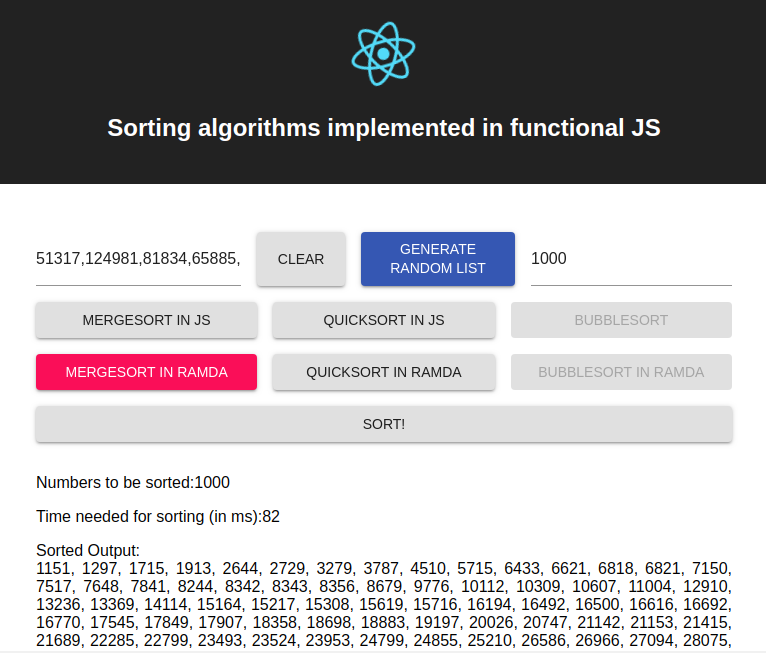

# Web UI for evaluating sorting algorithms in JS

Evaluate different sorting algorithm implemenations, e.g. comparing Ramda and lodash.
Generate a random list and see the results.

# Run

`npm install && npm run start`

# Demo

# TODOS
- add tail recursion for sorting functions
- add web-worker for sorting
